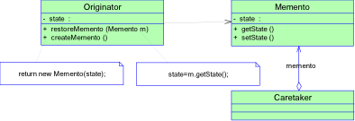

#备忘录模式(Memento Pattern)
##简介


备忘录模式有两个目标：

* 储存系统关键对象的重要状态；
* 维护关键对象的封装。

单一职责原则告诉我们，设计时不要把保持状态的工作和关键对象混在一起。这个专门掌握状态的对象，就称为备忘录。

备忘录模式提供了一种状态恢复的实现机制，使得用户可以方便地回到一个特定的历史步骤，当新的状态无效或者存在问题时，可以使用存储起来的备忘录将状态复原，当前很多软件都提供了Undo（撤销）操作功能，就使用了备忘录模式。 



Originator(发起人)：负责创建一个备忘录Memeto，用以记录当前时刻它的内部状态，并可以使用备忘录恢复内部状态。Originator可根据需要决定Memento储存Originator的哪些状态。

Memeto(备忘录)：负责存储Originator对象的内部状态，并可防止Originator意外的其它对象访问备忘录Memeto。备忘录有两个接口，Creataker只能看到备忘录的窄接口，它只能将备忘录传递给其它对象。Originator只能看到一个窄接口，允许它访问返回到先前状态所需的所有数据。

Caretaker(管理者)：负责保存好备忘录Memeto，不能对备忘录的内容进行操作或检查。

发起人(Originator)类

```
class Originator
{
	private string state;
	public string State
	{
		get {return state;}
		set {state = value;}
	}
	
	public Memnto CreateMemento()
	{
		return (new Memeto(state));
	}
	public void SetMemento(Memento memento)
	{
		state = memento.state
	}
	public void show()
	{
		Console.WriteLine("State="+ state);
	}
}
```

备忘录(Memento)类


```
class Memento
{
	private string state;
	public Memento(string state)
	{
		this.state = state;
	}
	public string State
	{
		get {return state;}
	}
}
```

管理者(Caretaker)类

```
class Caretaker
{
	private Memento memento;
	
	public Memento Memento
	{
		get {return memento;}
		set {memento = value;}
	}	
}
```

客户端程序

```
static void Main(string[] args)
{
	Originator o = new Originator();
	o.State = "On";
	o.show();
	
	Caretaker c = new Caretaker();
	c.Memento = o.CreateMemento();
	
	o.State = "Off";
	o.Show();
	
	o.SetMemento(c.Memento);
	o.Show();
	
	Console.Read();
	
}
```

Memento模式比较适用于功能比较复杂的，但是需要维护或者纪录属性历史的类，或者需要保存的属性只是众多属性中的一小部分时，Originator可以根据保存的Memento信息还原到前一状态。

如果在某个系统中使用命令模式时，需要实现命令的撤销功能，那么命令模式可以使用备忘录模式来储存可撤销操作的状态。

当角色状态改变的时候，有可能这个状态无效，这时候就可以使用暂时存储起来的备忘录将状态复原。

游戏角色类

```
class 游戏角色
{
	......
	
	//保存角色状态
	public RoleStateMemento SaveState()
	{
		return (new RoleStateMemento(vit, atk, def));
	}
	
	//恢复角色状态
	public void RecoveryState(RoleStateMemento memento)
	{
		this.vit = memento.Vitality;
		this.atk = memento.Attack;
		this.def = memento.Defense;
	}
	......
}
```

角色状态储存箱类

```
class RoleStateMemento
{
	private int vit;
	private int atk;
	private int def;
	public RoleStateMemento(int vit, int atk, int def)
	{
		this.vit = vit;
		this.atk = atk;
		this.def = def;
	}
	//生命力
	public int Vtality
	{
		get {return vit;}
		set {vit = value;}
	}	
	//攻击力
	public int Attack
	{
		get {return atk;}
		set {vit = value;}
	}
	//防御力
	public int Defense
	{
		get {return def;}
		set {def = value;}
	}
}
```

角色状态管理者

```
class RoleStateCaretaker
{
	private RoleStateMemeto memento;
	
	public RoleStateMemento Memento
	{
		get {return memento;}
		set {memento = value;}
	}
}
```

客户端代码

```
static void Main(string[] args)
{
	//大战Boss前
	GameRole lixiaoyao = new GameRole();
	lixiaoyao.GetInitState();
	lixiaoyao.StateDisplay();
	
	//保存进度
	RoleStateCaretaker stateAdmin = new RoleStateCaretaker();
	stateAdmin.memento = lixiaoyao.SaveState();
	
	//大战Boss时，损耗严重
	lixiaoyao.Fight();
	lixiaoyao.StateDisplay();
	
	//恢复之前状态
	lixiaoyao.RecoveryState(stateAdmin.Memento);
	lixiaoyao.StateDisplay();
	
	Console.Read();
}
```